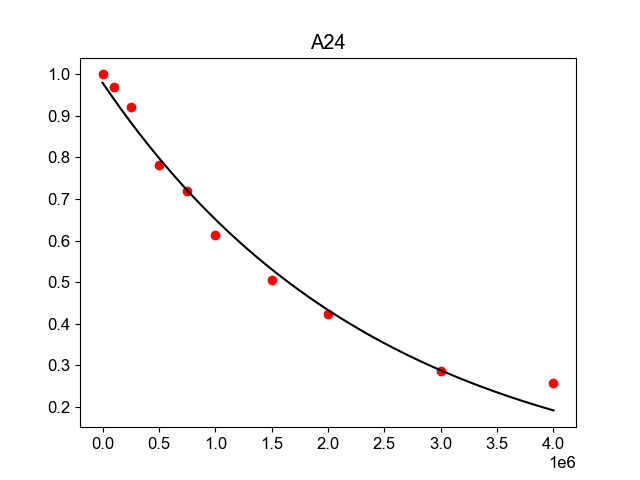

.. _fitting_t1_data:

fitting example: fitting_t1_data
================================

This example shows how to use nmrglue and the `SciPy <http://www.scipy.org/>`_
optimize module to fit T1 relaxation trajectories.  Three scripts are used in
the process.

The data used in this example is available for
`download. <https://storage.googleapis.com/google-code-archive-downloads/v2/code.google.com/nmrglue/example_fitting_t1_data.zip>`_

First the ``extract_trajs.py`` script reads in box limits from ``boxes.in`` and
a list of spectra from ``spectra.in``.  The script integrates each peak in each
spectrum and writes the trajectory for each peak to disk as ``traj.npy`` in
`NumPy <http://numpy.scipy.org/>`_ ``.npy`` format.

[:download:`extract_trajs.py <../../../examples/fitting_data/t1_measurements/extract_trajs.py>`]

.. literalinclude:: ../../../examples/fitting_data/t1_measurements/extract_trajs.py

[:download:`boxes.in <../../../examples/fitting_data/t1_measurements/boxes.in>`]

.. literalinclude:: ../../../examples/fitting_data/t1_measurements/boxes.in

[:download:`spectra.in <../../../examples/fitting_data/t1_measurements/spectra.in>`]

.. literalinclude:: ../../../examples/fitting_data/t1_measurements/spectra.in

The second script ``fit_exp_leastsq.py`` reads in this ``traj.npy`` file and the
T1 relaxation times associated with the spectra collected from ``time.dat``.
Each trajectory is fit using the least squares approach. Other optimization
algorithms can be substituted with small changes to the code, see the
`scipy.optimize <http://docs.scipy.org/doc/scipy/reference/optimize.html>`_
documentation).  The resulting fits are saved to a `fits.pickle` file for
easy reading into python as well as the human readable ``fits.txt`` file.

[:download:`fit_exp_leastsq.py <../../../examples/fitting_data/t1_measurements/fit_exp_leastsq.py>`]

.. literalinclude:: ../../../examples/fitting_data/t1_measurements/fit_exp_leastsq.py

[:download:`time.dat <../../../examples/fitting_data/t1_measurements/time.dat>`]

.. literalinclude:: ../../../examples/fitting_data/t1_measurements/time.dat

Results:

[:download:`fits.txt <../../../examples/fitting_data/t1_measurements/fits.txt>`]

.. literalinclude:: ../../../examples/fitting_data/t1_measurements/fits.txt

The last script ``pt.py`` reads in the fits, trajectories and T1
relaxation times and plots the experimental points and best fit to a series
of ``*_plot.png`` files.

[:download:`pt.py <../../../examples/fitting_data/t1_measurements/pt.py>`]

.. literalinclude:: ../../../examples/fitting_data/t1_measurements/pt.py

Results:

[:download:`A24_plot.png <../../../examples/fitting_data/t1_measurements/A24_plot.png>`]

