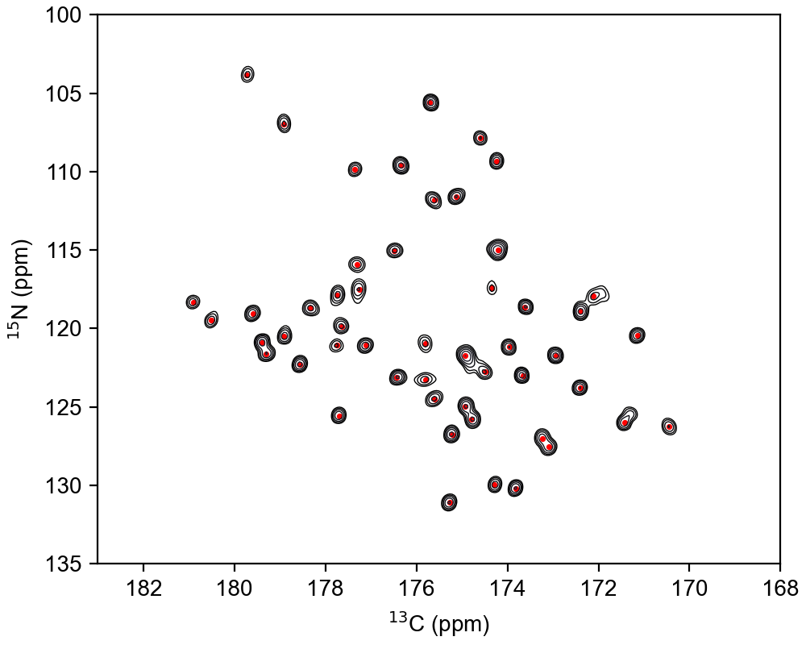

.. _peakpick:

Peak picking in multidimensional datasets
=========================================

NMRglue provides a single function (`ng.peakpick.pick`) that can pick peaks in multidimensional
NMR datasets. Currently, 4 algorithms are implemented (`thres`, `fast-thres`, `downward`, `connected`)
that can be passed as an argument to the keyword `algorithm` in the function call.  

The code below reads previously processed datasets, picks peaks above a given
threshold, and plots the spectrum with all the peaks marked. A unit conversion
object is used to do the conversions from points to ppm.

[:download:`source code <../../../examples/peak_picking/1d_picking.py>`]

.. literalinclude:: ../../../examples/peak_picking/1d_picking.py

[:download:`figure <../../../examples/peak_picking/peak_picking_1d.png>`]

.. image:: ../../../examples/peak_picking/peak_picking_1d.png

The function call for picking peaks spectra with dimensions > 1 is identical.
Only the way you plot the spectrum and add peak annotations is different. A
simple example is shown below

[:download:`source code <../../../examples/peak_picking/2d_picking.py>`]

.. literalinclude:: ../../../examples/peak_picking/2d_picking.py

[:download:`figure <../../../examples/peak_picking/peak_picking_2d.png>`]

