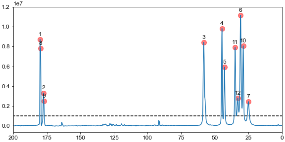

.. _peakpick:

Peak picking in multidimensional datasets
=========================================

This example shows how one can use nmrglue to pick peaks in multidimensional NMR
spectra and plot them. We first show this for 1d, 2d and 3d datasets, with examples
on how to annotate the peaks directly in the spectrum. We use the same data that was used in the `integration` examples. This data is available for 
`download. <http://nmrglue.googlecode.com/files/example_integrate_1d.zip>`_

Background
-----------

NMRglue provides a single function (`ng.peakpick.pick`) that can pick peaks in multidimensional
NMR datasets. Currently, 4 algorithms are implemented (`thres`, `fast-thres`, `downward`, `connected`)
that can be passed as an argument to `algorithm` in the function call. Here we will see how we can 
use this function for detecting peaks in 1d, 2d and 3d datasets. The code below reads in a previously processed data, picks peaks above a given
threshold, and plots the spectrum with all the peaks marked. A unit conversion object is
used to do the conversions from points to ppm.

[:download:`source code <../../../examples/peak_picking/1d_picking.py>`]

.. literalinclude:: ../../../examples/peak_picking/1d_picking.py

Results:

[:download:`figure <../../../examples/peak_picking/peak_picking_1d.png>`]

