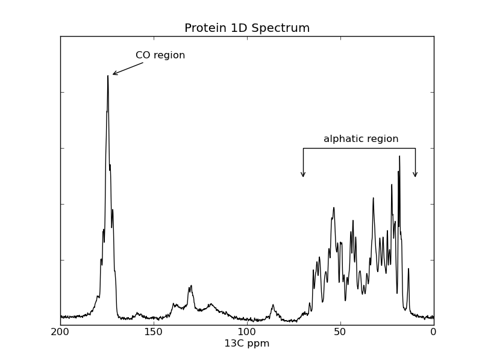

.. _plot_1d_freq:

plotting example: plot_1d_freq
==============================

This example shows how to use nmrglue and 
`matplotlib <http://matplotlib.sourceforge.net/index.html>`_ to create figures
for examining data or publication.  In this example the spectrum from a 1D 
NMRPipe file is plotted.

The data used in this example is available for 
`download. <https://storage.googleapis.com/google-code-archive-downloads/v2/code.google.com/nmrglue/example_plot_1d.zip>`_

[:download:`source code <../../../examples/plotting/plot_1d/plot_1d_pipe_freq.py>`]

.. literalinclude:: ../../../examples/plotting/plot_1d/plot_1d_pipe_freq.py

Results:

[:download:`figure <../../../examples/plotting/plot_1d/spectrum.png>`]

