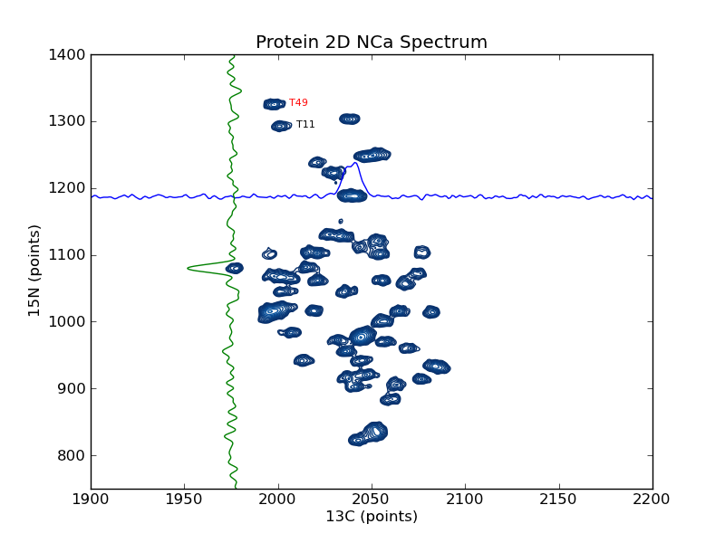

.. _plot_2d_spectrum_pts:

plotting example: plot_2d_spectrum_pts
======================================

This example shows how to use nmrglue and
`matplotlib <http://matplotlib.sourceforge.net/index.html>`_ to create figures
for examining data or publication.  In this example a contour plot of the
spectrum from a 2D NMRPipe file is created.  Slices are added in the 15N and
13C dimension as well as sample peak labels.  :ref:`plot_2d_spectrum`
is similar to this example but plotted on a ppm scale.

[:download:`source code <../../../examples/plotting/plot_2d/plot_spectrum_pts.py>`]

.. literalinclude:: ../../../examples/plotting/plot_2d/plot_spectrum_pts.py

Result:

[:download:`spectrum.png <../../../examples/plotting/plot_2d/spectrum_pts.png>`]

